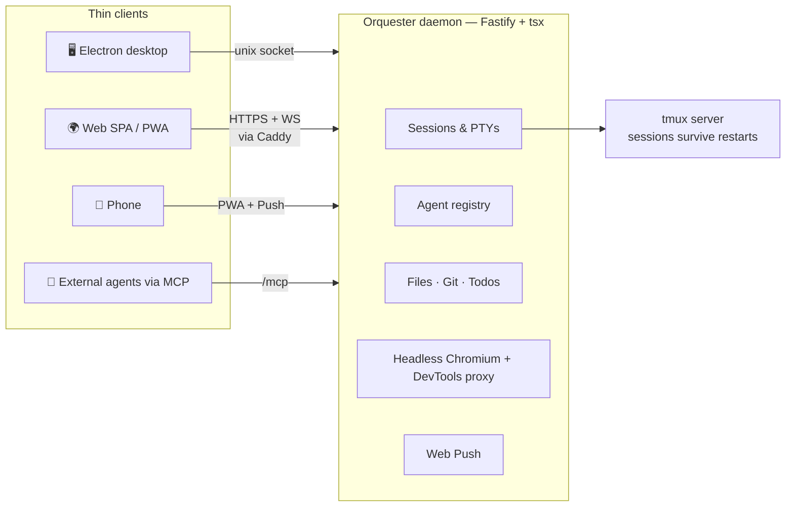

<div align="center">

# 🎛️ Orquester

**Your personal, self-hosted cockpit for AI coding agents.**

Run Claude Code, Codex, Gemini CLI and friends in persistent terminals on your own machine or VPS —
then drive them from a desktop app, any browser, or your phone.

[](LICENSE)
[](https://www.typescriptlang.org/)
[](https://nodejs.org/)
[](https://pnpm.io/)
[](https://www.electronjs.org/)
[](#-mobile--pwa)

*A private, self-hosted Coder/Gitpod — local-first, agent-native.*

</div>

---

## Why Orquester?

Coding agents are long-running, chatty processes that want your attention at unpredictable times. Orquester turns them into **sessions you can walk away from**:

- 🔄 **Sessions that never die** — every terminal lives in a daemon-owned, tmux-backed PTY. Close the tab, reload the browser, restart the daemon, switch from desktop to phone: the agent keeps working and the scrollback is intact.
- 🧑‍✈️ **A multi-agent cockpit** — grid view puts several agents, a shell, a git panel and a live browser side by side, each cell resizable.
- 📱 **Your phone is a first-class client** — installable PWA with a terminal key bar, file attach, drag-scroll through agent TUIs, and a web push when an agent needs you.
- 🔔 **End-to-end attention signalling** — agent hooks report *working / waiting / finished* → pulsing tab status dots → push notification on your phone.
- 🖱️ **Design Mode** — a real server-side Chromium streamed into a tab. Click any element of your running app and send its selector, React component chain, computed styles and a screenshot straight into an agent's prompt.
- 🔀 **Mix models inside one harness** — a managed CLI proxy runs GPT and any OpenAI-compatible router model inside the Claude Code harness, with per-tab model and account chips.

---

## ✨ Feature tour

### 🖥️ Terminals & sessions
- Real PTYs (node-pty) streamed over one multiplexed WebSocket — no per-terminal connection cap, instant reconnect with clean scrollback replay.
- Tabs with drag-reorder, inline rename, per-tab status lights (working / waiting / idle / finished / bell) and account & model badges.
- Drag & drop or paste files/screenshots into a terminal — they upload server-side and their paths are injected into the agent prompt.
- Bracketed multi-line pastes, Shift+Enter for newlines in agent prompts, selection-aware copy shortcuts that don't break Ctrl+C.
- Grid view: every open tab visible at once with drag-resizable rows/columns, persisted per project.

### 🤖 Agent registry & accounts
- One-click install/update for supported agents, with live version detection and enable-on-detect for everything else on your PATH.
- Multiple managed Claude/Codex accounts — run different tabs under different subscriptions, with a default per agent.
- Usage widget: rolling 5-hour and weekly quota gauges, reset countdowns, token counts and cost per day/model for Claude Code & Codex.
- **Model proxy**: run GPT and any OpenAI-compatible router model through the Claude Code harness via a daemon-supervised [CLIProxyAPI], with health states and a curated model catalog.
- **Router providers**: add OpenRouter, TokenRouter (one-click presets) or any custom OpenAI-compatible gateway — paste the key, pick models from the fetched catalog (or type them), set per-model aliases and context/compact windows. Keys are verified before storing, stay on the host, and never cross the wire.
- **Grok**: install xAI's **Grok Build** agent in one click, and link your Grok account with a device-code flow to run **Grok models** inside the Claude Code harness through the same model proxy — no API key, tokens stay with the proxy on disk.

### 🌐 Browser tabs (Design Mode)
- Per-project headless Chromium, screencast into a tab with full keyboard/mouse/touch forwarding and desktop ⇄ mobile viewport toggle.
- Element picker: batch up clicks on your running app, add a comment and an intent (fix / change / question), and deliver a formatted "Design Feedback" block — screenshots included — into any agent session.
- **Embedded Chrome DevTools**: the browser's own version-matched DevTools frontend, proxied by the daemon, docked in a resizable split.
- Dev-server URL sniffing: Vite/Next/CRA banners in your terminals become one-click browser suggestions.

### 📁 Files, git & todos
- File browser + CodeMirror 6 editor with language auto-detect, fuzzy filename search and ripgrep-style content search (regex, globs, whole-word).
- Rich previews: images, PDF, audio/video, sandboxed HTML, ZIP/RAR/7z/tar listings, and a virtualized sortable **Parquet viewer**.
- Upload files or whole folders (with conflict resolution), download any file, or download a folder as a server-zipped archive.
- GitHub-Desktop-style git tab: stage/unstage, diffs, suggested commit messages, branch switcher, ahead/behind counts, fetch/pull/push, paged history.
- Notion-style todo lists scoped to a project or workspace, synced through the daemon to every client.

### 🔑 Git hosting identities
- Connect multiple GitHub, Bitbucket Cloud and Bitbucket Server/Data Center accounts; each workspace commits and pushes as its own identity via server-generated SSH keys (uploaded to the provider for you) and git `includeIf`.
- Tokens enable repo listing/creation, cloning from a picker or a pasted URL, and CLI auth inside that workspace's terminals — they never cross the wire and never appear on a command line.
- Self-hosted Bitbucket is first class: custom CA bundle, context paths, `links.clone`-driven URLs, and a manual key-paste fallback when the instance won't accept key uploads over its API.

### 📱 Mobile & PWA
- Installable PWA with offline app shell, visual-viewport-aware layout (nothing hides under the soft keyboard), and instant wake-from-sleep reconnect.
- Mobile key bar (Esc / Tab / ⌃C / ⌃D / arrows / ↵), font sizing, file attach, and one-finger scroll that works inside full-screen agent TUIs.
- Web Push (VAPID) when an agent needs input or finishes — debounced, per-session, with a test button.

### 🔌 MCP server built in
The daemon exposes a Streamable-HTTP **MCP endpoint** (`POST /mcp`) so *other* agents can orchestrate your sessions: list workspaces/tabs, read terminals, send input and keys, wait for idle/attention, create/close tabs, manage todos, browse files and check usage.

---

## 🧰 What can it launch?

| Category | Entries |
|---|---|
| **Agents** | Claude Code · Codex · Gemini CLI · DeepSeek · OpenCode · Grok Build · Claude Code × GPT/Kimi/Grok (via managed proxy) |
| **Shells** | Bash · Zsh · Fish · Nushell · PowerShell · cmd · sh |
| **File explorers** | Nautilus · Dolphin · Thunar · Nemo · PCManFM · Caja · Explorer · system fallback |
| **Browsers** | Chrome · Chromium · Brave · Edge · Vivaldi · Firefox · system fallback |

Agents are installed straight from the UI (native installer for Claude Code, `npm install -g` for the rest); everything else is detected on PATH.

---

## 🏗️ Architecture

One **daemon owns everything** — PTYs, files, git, browsers, push. Clients are thin views over the same wire protocol.



- **Two transports, one server**: an always-on Unix socket (desktop, trusted) and an opt-in, hot-reloadable HTTP transport (remote web, bearer-auth) — flip remote access on/off without touching running sessions.
- **tmux-backed persistence**: commands live in a dedicated tmux server, so a daemon restart or redeploy reattaches to every running agent. Falls back to direct node-pty where tmux < 3.2 (Windows, stock macOS) — sessions then don't survive restarts.
- **State is plain JSON** under one appdir (`~/.orquester` by default) — no database.

### Monorepo layout

| Package | Role |
|---|---|
| `apps/daemon` | The core: Fastify HTTP/WS + Unix-socket server owning sessions, registry, accounts, files, browsers, push, MCP |
| `apps/desktop` | Electron shell embedding the daemon in-process |
| `apps/web` | Vite SPA — thin remote client + PWA |
| `packages/ui` | Shared React UI (zustand, xterm.js, CodeMirror) used by both clients |
| `packages/api` | Pure TypeScript wire contracts + reference HTTP client |
| `packages/config` | Appdir layout, defaults, zod schemas |
| `packages/registry` | Static catalog of launchable shells/agents/IDEs/explorers/browsers |

Packages import each other's TypeScript **source** directly — the daemon runs via `tsx` in dev *and* production. There is no daemon build step.

---

## 🚀 Getting started

**Prerequisites:** Node 20 LTS · pnpm 10 · tmux ≥ 3.2 (optional but strongly recommended — it's what makes sessions survive restarts).

```sh
git clone git@github.com:JasperRaccoon/orquester.git
cd orquester
pnpm install          # postinstall fixes node-pty's exec bit

# Option A — desktop app (Electron + embedded daemon), sandboxed in ./.stage
pnpm dev

# Option B — daemon + web client
pnpm dev:daemon       # daemon on 127.0.0.1:47831, sandboxed in ./.stage
pnpm dev:web          # Vite SPA on http://127.0.0.1:5173
```

The `dev` scripts run against `./.stage`, a committed sandbox appdir, so experiments never touch your real `~/.orquester` (the stage login password is `123456` — dev sandbox only, never used in production). Use `pnpm dev:bare` / `pnpm dev:daemon:bare` to run against the real appdir.

| Script | What it does |
|---|---|
| `pnpm dev` | Desktop app (Electron + in-process daemon), staged |
| `pnpm dev:daemon` | Daemon only, `tsx watch`, staged |
| `pnpm dev:web` | Web SPA pointed at the local daemon |
| `pnpm build` | Builds the web SPA + desktop bundles |
| `pnpm check` | Typecheck across the monorepo — **the pre-commit gate** |

---

## ☁️ Self-hosting on a VPS

Orquester ships a complete single-command deployment story for Ubuntu:

```sh
cp deploy/targets.conf.example deploy/targets.conf   # define your host(s)
./deploy.sh provision myvps    # fresh VPS → running daemon behind Caddy + TLS + ufw
./deploy.sh deploy all         # routine updates: fetch, install, build, restart, smoke test
./deploy.sh verify all         # health, service state, live bundle hash
./deploy.sh rollback myvps <sha>
./deploy.sh rotate-password myvps
```

What you get on the box:

- **systemd-hardened daemon** (`ProtectSystem=strict`, unprivileged user, read-only code in `/opt`) with `KillMode=process` — restarts and redeploys leave the tmux server and all your agent sessions running.
- **Caddy** as the only public face: automatic Let's Encrypt TLS, HSTS, strict CSP, WebSocket upgrades; the daemon itself stays on loopback and `ufw` allows only 22 + 443.
- **Post-deploy browser smoke test** that loads the deployed SPA headlessly — with clean *and* legacy localStorage fixtures — and fails the deploy on any page error.

See [`deploy/`](deploy/) and `AGENTS.md` for the full reference.

---

## 🔐 Security model

Single-user by design, and honest about it:

- **The password never crosses the wire.** The client fetches the bcrypt salt and derives the hash locally; the server verifies in constant time with one identical 401 for every failure mode.
- **Escalating per-IP login throttle** behind Caddy's forwarded IP, on top of whatever fail2ban you run.
- **Secrets stay home**: SSH private keys, git-hosting tokens (GitHub PATs, Bitbucket API tokens) and the VAPID push key are 0600 on disk and never returned by any API; `?token=` credentials are redacted from logs; daemon env vars are stripped from session environments.
- **Sandboxed filesystem API**: every path is realpath-checked against the workspaces root — no traversal, no symlink escapes; folder zips store symlinks instead of following them.
- **Transport asymmetry**: daemon config writes and shutdown are Unix-socket-only; the MCP endpoint and DevTools proxy exist only on the authenticated remote transport.

---

## 📄 License

[MIT](LICENSE) © 2026 JasperDev

<div align="center">
<sub>Made by JasperDev - Forked from Sammwy's orquester</sub>
</div>

[CLIProxyAPI]: https://github.com/router-for-me/CLIProxyAPI
